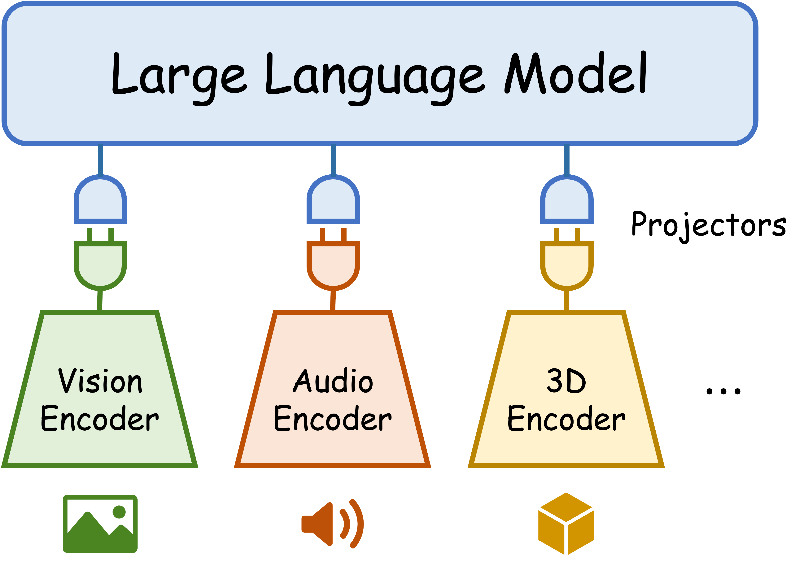
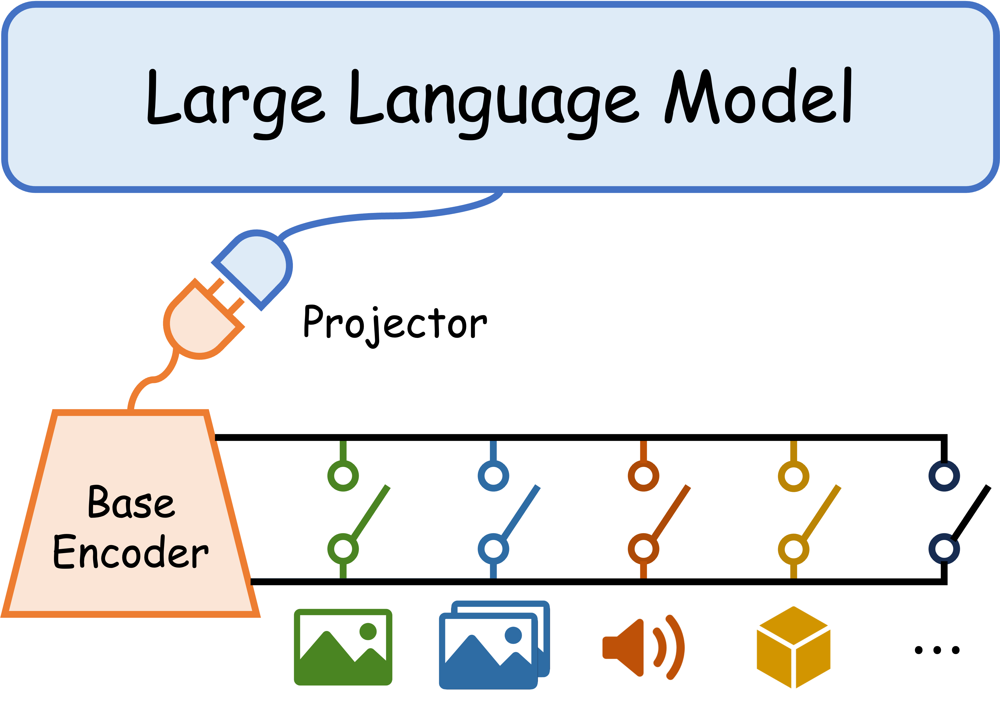
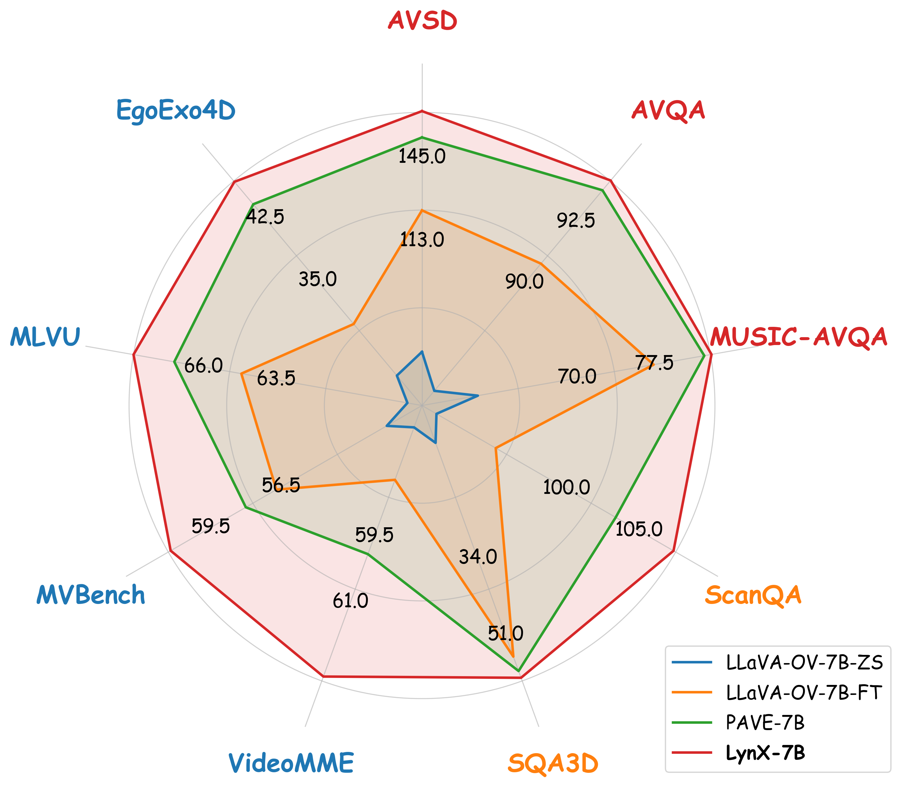
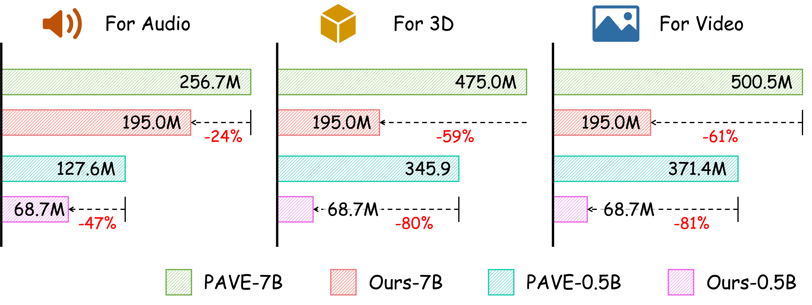

# LynX

LynX is a multi-modal instruction-following model with unified training/evaluation scripts for audio, 3D, egocentric video, and high-frame-rate video benchmarks.

## Overview

<p align="center">
  
</p>

**Figure 1.** Overview of the proposed method.

## Comparison to prior approaches

<table>
  <tr>
    <td align="center" width="50%">
      
      <br/>
      <b>(a)</b> Existing approaches
    </td>
    <td align="center" width="50%">
      
      <br/>
      <b>(b)</b> Our LynX
    </td>
  </tr>
</table>

**Figure 3.** (a) Existing approaches require modality-specific encoders/projectors and paired supervision; (b) LynX integrates new modalities by repurposing the internalized interface.

<table>
  <tr>
    <td align="center" width="50%">
      
      <br/>
      <b>(a)</b> Performance highlight
    </td>
    <td align="center" width="50%">
      
      <br/>
      <b>(b)</b> Parameter comparison
    </td>
  </tr>
</table>

**Figure 2.** (a) Performance highlight. (b) Parameter comparison.

## Environment

We provide two Conda environment files:

- A6000 GPUs: `environment.yml`
- RTX PRO 6000 Blackwell GPUs: `environment_blackwell.yml`

Create an environment (example):

```bash
conda env create -f environment.yml
conda activate lynx
```

Blackwell variant:

```bash
conda env create -f environment_blackwell.yml
conda activate lynx-blackwell
```

## Data preparation

This repo expects datasets under `data/video_instruction_tuning/` (see `data/video_instruction_tuning/README.md`).

For dataset preparation, follow the PAVE documentation and place the processed files to match our script defaults:

- PAVE docs: https://github.com/dragonlzm/PAVE/tree/main/doc
- Local index: `docs/data_preparation/README.md`

## Training & inference

All commands below run the provided scripts. Pick one of:

- `scripts/0.5b/` for the 0.5B model size
- `scripts/7b/` for the 7B model size

To run the 7B setting, replace `scripts/0.5b/...` with the corresponding `scripts/7b/...` script (when available).

Terminology:

- **Interface alignment**: Stage-1/2 training via `train_lynx.py`
- **Instruction tuning**: Stage-3 SFT via `train_lynx_sft.py`
- **Inference**: benchmark-specific evaluation scripts

### AVQA (audio)

```bash
# Interface alignment
bash scripts/0.5b/avqa_train.sh

# Instruction tuning
bash scripts/0.5b/avqa_sft.sh

# Inference
bash scripts/0.5b/avqa_eval.sh
```

### Music-AVQA (audio)

```bash
# Interface alignment
bash scripts/0.5b/music_avqa_train.sh

# Instruction tuning
bash scripts/0.5b/music_avqa_sft.sh

# Inference
bash scripts/0.5b/music_avqa_eval.sh
```

### AVSD / Charades (audio)

```bash
# Interface alignment
bash scripts/0.5b/avsd_train.sh

# Instruction tuning
bash scripts/0.5b/avsd_sft.sh

# Inference
bash scripts/0.5b/avsd_eval.sh
```

### Ego-Exo4D (egocentric video)

`egoexo_train.sh` can optionally run Stage-3 SFT in the same script.

```bash
# Interface alignment (Stage-1/2 only)
RUN_STAGE3=0 bash scripts/0.5b/egoexo_train.sh

# Instruction tuning (runs Stage-3 SFT after Stage-1/2)
RUN_STAGE3=1 bash scripts/0.5b/egoexo_train.sh

# Inference (set adapter paths as needed)
bash scripts/egoexo_eval.sh
```

### ScanQA + SQA3D (3D)

We do **not** separate interface alignment per 3D benchmark; run the shared 3D interface-alignment once, then run instruction-tuning and inference per benchmark.

```bash
# Shared interface alignment for 3D
bash scripts/0.5b/3d_train.sh

# Instruction tuning
bash scripts/0.5b/scanqa_sft.sh
bash scripts/0.5b/sqa_sft.sh

# Inference
bash scripts/0.5b/scanqa_eval.sh
bash scripts/0.5b/sqa_eval.sh
```

### LLaVA-Video-178K (FastVideo / high-FPS video)

`llava_video.sh` can optionally run Stage-3 SFT in the same script.

```bash
# Interface alignment (Stage-1/2 only)
RUN_STAGE3=0 bash scripts/7b/llava_video.sh

# Instruction tuning (runs Stage-3 SFT after Stage-1/2)
RUN_STAGE3=1 bash scripts/7b/llava_video.sh

# Inference (VideoMME / MVBench / MLVU via lmms-eval)
bash scripts/0.5b/llava_video_eval_lmms.sh
```
